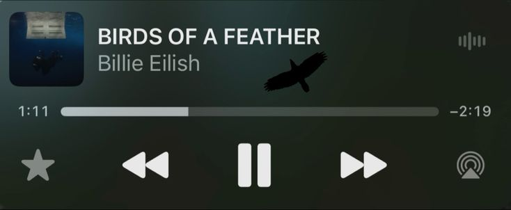

## ハンターの皆さん、ようこそ！


###  &nbsp; Hello, I'm Dezra! &nbsp; 


Welcome to my GitHub profile! I'm a passionate developer who loves exploring new technologies and building impactful projects. 

###  &nbsp; Tech Stack

- **Languages:** JavaScript/TypeScript, PHP
- **Frameworks & Libraries:** React.js, Next.js, Remix, Svelte, SvelteKit, Laravel
- **Databases:** MySQL, PostgreSQL, MongoDB
- **Tools:** Git, VSCode, Proteus, VM Ware


Thanks for stopping by! 🚀


###  &nbsp; Just Random Stats & Activity

[](https://holopin.io/@abnvlf)

<!--START_SECTION:waka-->

```txt
Svelte                     818 hrs 51 mins ████████████▒░░░░░░░░░░░░   48.69 %
TypeScript                 432 hrs 48 mins ██████▒░░░░░░░░░░░░░░░░░░   25.74 %
PHP                        126 hrs 20 mins ██░░░░░░░░░░░░░░░░░░░░░░░   07.51 %
SQL                        77 hrs 59 mins  █░░░░░░░░░░░░░░░░░░░░░░░░   04.64 %
Blade Template             57 hrs 9 mins   █░░░░░░░░░░░░░░░░░░░░░░░░   03.40 %
```

<!--END_SECTION:waka-->


###

<div align="center">
    
  <a href="">
    
  </a>
  
  <a href=""></a>
</div>
